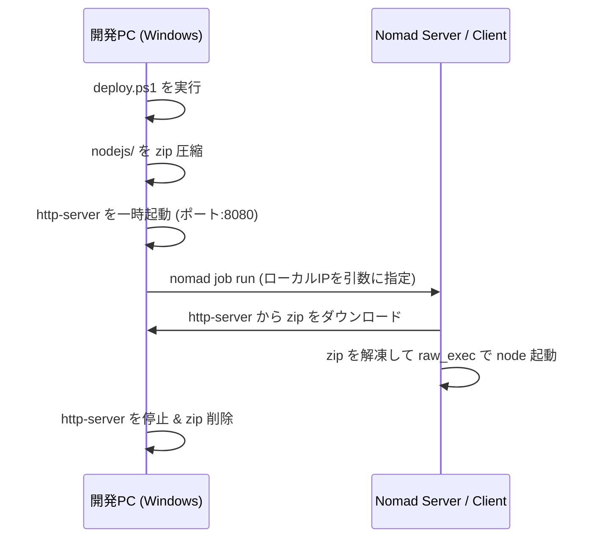

# Nomad 自動デプロイ手順書 (ZIP & Artifact 方式)

開発PC（Windows）上で修正したバックエンドの Node.js サーバーを、Nomad の `artifact` 機能を利用して自動デプロイするためのガイドです。

## デプロイの仕組み


## 事前準備

### 1. 開発PC（Windows）側の準備
* **Nomad CLI** がインストールされ、環境変数 `PATH` に追加されている必要があります。
  * コマンドプロンプトや PowerShell で `nomad version` が動作することを確認してください。
* **Node.js** がインストールされていること（一時的な HTTP サーバー配信に `npx http-server` を使用します）。
* デプロイ先 Nomad サーバーを指すように、環境変数 `NOMAD_ADDR` を設定してください。
  ```powershell
  $env:NOMAD_ADDR="http://<NomadサーバーのIP>:4646"
  ```

### 2. Nomad クライアント（Linux/デプロイ先）側の準備
* タスクドライバーに **`raw_exec`** が使用されているため、Nomad クライアントの設定ファイル（`nomad.hcl`）で `raw_exec` の実行が許可されている必要があります。
  ```hcl
  client {
    options {
      "driver.raw_exec.enable" = "1"
    }
  }
  ```
  ※設定変更後、Nomad クライアントの再起動（`sudo systemctl restart nomad` 等）が必要です。
* Node.js v24 が対象サーバーの指定パス（`/home/mattya3340/.nvm/versions/node/v24.16.0/bin/node`）に配置されていることを確認してください。必要に応じて [loc-api.nomad](file:///c:/シス開/L.O.C.-Algorithm/back/loc-api.nomad) 内の `command` パスを書き換えてください。

---

## デプロイ実行手順

1. **PowerShell** を管理者権限または適切な権限で起動します。
2. `back` ディレクトリに移動します。
3. デプロイスクリプトを実行します。
   ```powershell
   Set-ExecutionPolicy Bypass -Scope Process -Force
   .\deploy.ps1
   ```

### スクリプトの処理内容
1. 開発PCのローカルIPを自動検出します。
2. `back/nodejs` 内のファイルを `loc-api.zip` に圧縮します。
3. `back/.env` の MySQL 接続設定（ポート、ユーザー、パスワード等）をパースし、Nomad 変数（`-var`）として自動指定します。
4. ポート `8080` で一時的に `http-server` を立ち上げ、ZIP を配信します。
5. Nomad に対し、変数（`deploy_host`）を渡してジョブを登録・実行します。
6. Nomad クライアントによる ZIP ダウンロード完了を待機（10秒）した後、一時 HTTP サーバーを自動で停止し、ZIP ファイルをクリーンアップします。

---

## トラブルシューティング

* **「driver.raw_exec.enable」エラーが発生する場合**
  Nomad クライアント側の設定ファイルで `raw_exec` ドライバが有効化されていません。上記の「Nomad クライアント側の準備」に従って有効化してください。
* **ZIPのダウンロード（Artifact）に失敗する場合**
  開発PCのセキュリティ（Windows Defender ファイアウォール等）により、ポート `8080` への外部（Nomadクライアント）からの接続がブロックされている可能性があります。
  一時的にポート `8080` の受信を許可するか、ファイアウォール設定を確認してください。
* **MySQL接続エラーが発生する場合**
  Nomad 上の API サーバーからアクセス可能な MySQL ホスト名およびポートが正しく指定されているか、`back/.env` または [loc-api.nomad](file:///c:/シス開/L.O.C.-Algorithm/back/loc-api.nomad) 内の variables を確認してください。
